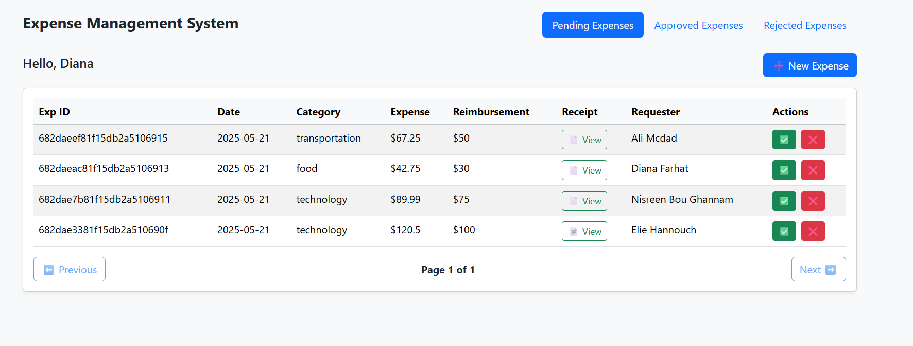

markdown
Copy
Edit
# 💰 Expense Management App

Easily track and manage expenses, reimbursements, and receipts with file uploads.


---

## 🚀 How to Run Locally

### 1. Clone the Repository

```bash
git clone https://github.com/your-username/expense-management.git
cd expense-management
2. Install Backend Dependencies
bash
Copy
Edit
cd backend
npm install
3. Install Frontend Dependencies
bash
Copy
Edit
cd ../frontend
npm install
4. Start the Backend Server
Make sure MongoDB is running locally, or update your .env file with your database URI.

bash
Copy
Edit
cd ../backend
npm run dev
5. Start the Frontend React App
bash
Copy
Edit
cd ../frontend
npm start
6. Open in Browser
Visit: http://localhost:3000

🌱 .env Example (Backend)
Create a .env file inside the backend/ folder:

env
Copy
Edit
PORT=5000
MONGO_URI=mongodb://localhost:27017/expenses
📁 File Uploads
Uploaded invoices (PDF or image) are stored using multer. Make sure the uploads/ folder exists inside backend/.

📷 Screenshot Location
Ensure your screenshot file readme.png is located at:

arduino
Copy
Edit
frontend/public/readme.png
It will display correctly from the Markdown if the root README.md is placed in the frontend/ folder. If it's in the root of the project, use:

markdown
Copy
Edit

✅ Features
📅 Date, category, and amount entry

👤 Requester auto-filled from localStorage.name

📎 Optional invoice upload (.pdf or images)

📊 Status tracking (pending/approved/rejected)